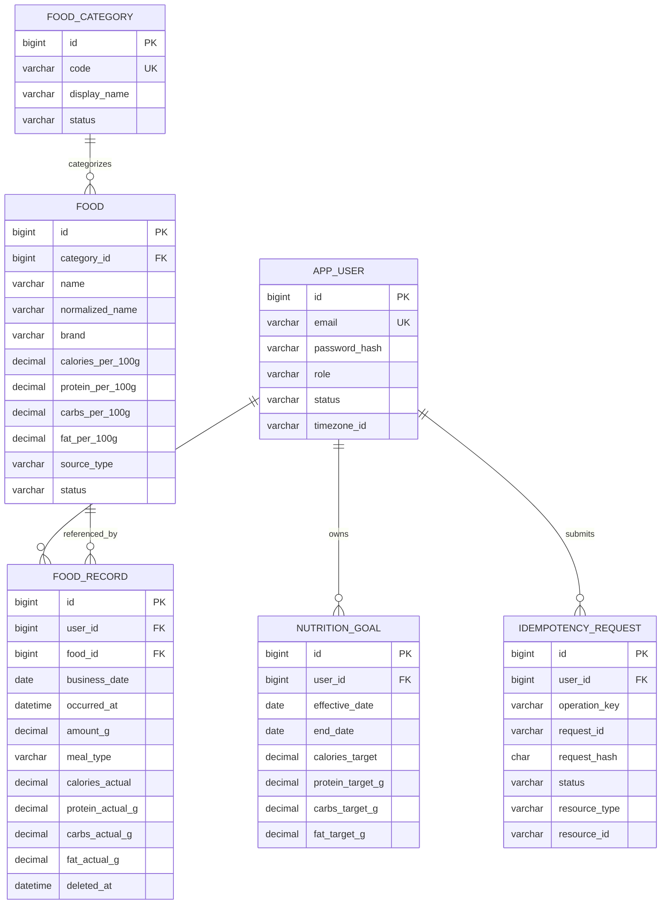

# Fitness Platform — V1 数据库详细设计

> 目标环境：MySQL 8.0.16+ / InnoDB / utf8mb4 / Flyway  
> 对应产品阶段：V1 饮食记录 MVP  
> 设计原则：V1 先形成稳定事实底座；不把 V1.1/V2/V3 的功能提前做进 V1，但对“历史事实不可被未来主数据修改污染”的字段，在 V1 首次写事实时就完成必要快照。

---

## 1. V1 数据库范围

V1 只建立以下权威数据：

1. 用户账户与时区；
2. Food Category / Food 当前食品库；
3. Nutrition Goal 历史有效区间；
4. Food Record 饮食事实；
5. 服务端幂等请求。

V1 不建立 AI、RAG、图片、Export、训练、社交相关表。

### 1.1 V1 表清单

| 表 | 类型 | 说明 |
| --- | --- | --- |
| `app_user` | 主数据 | 用户身份、状态、角色、时区 |
| `food_category` | 主数据 | Food 分类字典 |
| `food` | 主数据 | 当前食品标准 |
| `nutrition_goal` | 历史配置 | 用户营养目标有效期 |
| `food_record` | 事实表 | 实际摄入事实 + 历史营养快照 |
| `idempotency_request` | 技术表 | 防止双击、网络重试、未来 Tool 重试产生重复写入 |

---

## 2. 核心建模原则

### 2.1 Food 是“当前标准”，Food Record 是“历史事实”

`food` 中保存当前可用的食品营养标准。管理员以后修改 Food 时，只影响后续新记录。

`food_record` 在创建时保存：

- Food 名称快照；
- Brand 快照；
- Category 快照；
- Source 快照；
- Calories/P/C/F per 100g 快照；
- amount；
- 按服务端规则计算出的实际 Calories/P/C/F。

这样 V1.2 按 Category/Brand/Source 聚合历史数据时，也不会因为 Food 之后被改名、改分类、改品牌而改变历史统计语义。

### 2.2 Goal 是有效区间，不是单一“当前值”

`nutrition_goal` 使用：

- `effective_date`：生效日；
- `end_date`：结束日，设计为**包含当天**；
- 指标允许部分为 `NULL`。

查询某一天 `:d` 的 Goal：

```sql
SELECT *
FROM nutrition_goal
WHERE user_id = :userId
  AND effective_date <= :d
  AND (end_date IS NULL OR end_date >= :d)
ORDER BY effective_date DESC
LIMIT 1;
```

数据库可约束同一个用户相同 `effective_date` 不重复，但“两个日期区间不能重叠”无法仅靠普通 UNIQUE 完整表达，因此必须在 Service 事务中校验。

### 2.3 时间统一

数据库连接与 JVM 持久化层统一使用 UTC：

- `occurred_at`：UTC 的实际发生时刻；
- `created_at`：系统收到数据的 UTC 时刻；
- `business_date`：根据用户当时的 IANA timezone 计算后固化的业务日期。

用户之后修改时区时，已有 `business_date` 不自动重算。

从 V3.6 完整性加固开始，`food_record.business_timezone_id`（训练域对应 `workout_session.business_timezone_id`）保存生成该 `business_date` 时使用的 IANA timezone。为避免对已有历史数据伪造来源，该字段对 legacy row 允许为 NULL；所有新写入/合法历史编辑必须由 Service 显式写入。

推荐 JVM 启动参数/连接配置确保 JDBC session timezone 为 UTC，不依赖 MySQL server 本机时区。

### 2.4 金额/营养数值禁止 FLOAT/DOUBLE

Java 使用 `BigDecimal`，MySQL 使用 `DECIMAL`：

- Food 每 100g：`DECIMAL(12,4)`；
- amount：`DECIMAL(12,3)`；
- actual nutrition：`DECIMAL(12,4)`；
- Goal：`DECIMAL(12,4)`。

服务端计算：

```text
actual = per100g × amount_g / 100
```

建议内部计算使用高精度 `MathContext`，落库前统一 `setScale(4, HALF_UP)`；UI 再按展示需要舍入。不要把前端预览值直接落库。

---

## 3. V1 ERD



---

## 4. 表设计说明

## 4.1 `app_user`

### 关键字段

- `email`：注册唯一标识。Service 入库前执行 `trim + lowercase`；数据库唯一索引做最终兜底。
- `password_hash`：只保存 BCrypt/Argon2 等密码哈希，不保存明文。
- `role`：V1 先支持 `USER` / `ADMIN`。
- `status`：`ACTIVE` / `DISABLED`；禁用用户在认证层拒绝登录。
- `timezone_id`：保存 IANA ID，例如 `Asia/Shanghai`、`America/Los_Angeles`，不要保存 `UTC+8` 这种无法正确表达 DST 的固定字符串。
- `row_version`：供 JPA/MyBatis 乐观锁使用。

### 为什么不单独拆 Profile 表

V1 用户资料很少，只有认证与 timezone；此时拆表没有收益。后续如果加入昵称、头像、隐私设置、OAuth Identity，再独立迁移。

---

## 4.2 `food_category`

Food 分类独立成字典而不是直接在 `food.category` 写自由字符串，原因：

- 分类筛选需要稳定 code；
- 分类显示名称未来可能本地化；
- 可以停用分类但不破坏历史 Food；
- V1.2 按 Category 聚合时更稳定。

PRD 未定义完整分类体系，因此 migration 只提供技术兜底 `OTHER`，真正 taxonomy 由产品/初始化数据决定。

---

## 4.3 `food`

这是食品**当前标准表**。

### 搜索字段

`normalized_name` / `normalized_brand` 由 Java Service 维护，用于：

- 完全匹配；
- prefix 搜索；
- 简单 contains 搜索前的规范化。

V1 数据量不大时可以使用：

```sql
SELECT ...
FROM food
WHERE status = 'ACTIVE'
  AND (
      normalized_name LIKE CONCAT('%', :q, '%')
      OR normalized_brand LIKE CONCAT('%', :q, '%')
  )
ORDER BY
  CASE WHEN normalized_name = :q THEN 0
       WHEN normalized_name LIKE CONCAT(:q, '%') THEN 1
       ELSE 2 END,
  id
LIMIT :limit OFFSET :offset;
```

注意：`LIKE '%xxx%'` 无法完整利用普通 B-Tree。V1 允许先接受；V1.1 再引入 alias、Redis 热点、第三方搜索，以及按真实数据量决定是否增加 MySQL ngram FULLTEXT/独立搜索引擎。

### 禁止硬删除 Food

`food.status = INACTIVE` 后：

- 新记录禁止使用；
- 旧 `food_record` 继续通过 FK 和快照正常展示。

因此 `food_record.food_id -> food.id` 使用 `ON DELETE RESTRICT`。

---

## 4.4 `nutrition_goal`

### NULL 的业务含义

`NULL` 表示“用户没有设置这个指标”。

禁止用 0 表示未设置，因为 0 会造成：

- Dashboard 错误计算 completion；
- “剩余/超出”失真；
- 后续 AI 误判用户目标。

### 防止时间区间重叠

推荐 Service 写入流程：

```text
BEGIN
→ SELECT app_user WHERE id = :userId FOR UPDATE  -- 先取得稳定的 per-user mutex
→ SELECT 该用户 Goal（可再 FOR UPDATE）
→ 校验新 effective/end 与现有区间不重叠
→ 如新目标接替旧目标，先把旧目标 end_date 调整到新 effective_date - 1 day
→ INSERT/UPDATE 新目标
COMMIT
```

同一天只能命中一组 Goal。

只锁现有 `nutrition_goal` 行并不足以完全解决“当前没有覆盖该日期的行时两个事务同时插入”的竞态；因此统一锁 `app_user` 行作为该用户 Goal 写事务的互斥点。不要依赖前端串行化。

---

## 4.5 `food_record`

这是 V1 最重要的事实表。

### 事实字段与快照字段分离

**事实输入：**

- `food_id`
- `amount_g`
- `occurred_at`
- `business_date`
- `meal_type`
- `note`

**快照：**

- `food_name_snapshot`
- `food_brand_snapshot`
- `food_category_code_snapshot`
- `food_source_type_snapshot`
- `*_per_100g_snapshot`

**计算事实：**

- `calories_actual`
- `protein_actual_g`
- `carbs_actual_g`
- `fat_actual_g`

### 为什么同时保存 per100g snapshot 和 actual

两者用途不同：

- actual 用于 Dashboard/History/Analytics 快速汇总；
- per100g snapshot 用于用户只修改 amount 时，按“原历史食品标准”重算。

当用户把 Food 改为另一个 Food 时，则重新读取新 Food 的当前标准，重建全部快照。

### Soft Delete

V1 UI 不提供回收站，但数据库采用 `deleted_at`：

- 历史、Dashboard、统计统一 `deleted_at IS NULL`；
- 便于排查误删除、AI trace 和幂等问题；
- 不等于产品提供“恢复记录”功能。

如果以后需要满足账户彻底删除/隐私擦除要求，使用专门的数据删除流程物理清理，不依赖 soft delete 永久保留。

### 编辑窗口

“最近一个月可编辑”属于动态业务规则，不做数据库 CHECK；所有写入口必须调用同一个 Domain Service 校验 `occurred_at/business_date`。

---

## 4.6 `idempotency_request`

V1 就建立通用表，而不是只给 `food_record` 增加 `request_id`，原因是它会被：

- V1 单条记录；
- V1.1 多食品 batch；
- V1.2 Export Job；
- V2 AI Confirm / Tool；
- V3 Workout 写操作

复用。

唯一键：

```text
(user_id, operation_key, request_id)
```

推荐处理流程：

```text
1. 客户端生成 requestId
2. 服务端规范化请求并计算 request_hash
3. 尝试 INSERT PROCESSING
4. 唯一键冲突：读取原记录
   - hash 不同 -> 409 IDEMPOTENCY_KEY_REUSED
   - SUCCEEDED -> 返回第一次 response/resource
   - PROCESSING -> 返回处理中状态
5. 同一事务创建 Food Record
6. 更新 idempotency_request = SUCCEEDED + resource_id/response_json
7. COMMIT
```

`request_hash` 防止客户端错误地拿同一个 requestId 提交不同业务内容。

---

## 5. V1 关键索引

| 表 | 索引 | 服务对象 |
| --- | --- | --- |
| `app_user` | `UK(email)` | 注册/登录 |
| `food` | `(status, normalized_name)` | Food Search |
| `food` | `(category_id, status)` | 分类筛选 |
| `nutrition_goal` | `(user_id,effective_date,end_date)` | 日期命中 Goal |
| `food_record` | `(user_id,business_date,deleted_at,occurred_at)` | Today/History |
| `food_record` | `(user_id,food_id,business_date)` | V1.1 最近/常吃 |
| `food_record` | `(user_id,meal_type,business_date)` | Meal 分组/过滤 |
| `idempotency_request` | UK `(user_id,operation_key,request_id)` | 幂等 |

不建议在 V1 盲目增加很多单列索引。应使用真实 SQL + `EXPLAIN ANALYZE` 决定后续优化。

---

## 6. V1 典型 SQL

### 6.1 Today Dashboard 汇总

```sql
SELECT
    COALESCE(SUM(calories_actual), 0) AS calories,
    COALESCE(SUM(protein_actual_g), 0) AS protein_g,
    COALESCE(SUM(carbs_actual_g), 0) AS carbs_g,
    COALESCE(SUM(fat_actual_g), 0) AS fat_g
FROM food_record
WHERE user_id = :userId
  AND business_date = :businessDate
  AND deleted_at IS NULL;
```

### 6.2 Today 时间线

```sql
SELECT *
FROM food_record
WHERE user_id = :userId
  AND business_date = :businessDate
  AND deleted_at IS NULL
ORDER BY occurred_at ASC, id ASC;
```

### 6.3 日期有效 Goal

```sql
SELECT *
FROM nutrition_goal
WHERE user_id = :userId
  AND effective_date <= :businessDate
  AND (end_date IS NULL OR end_date >= :businessDate)
ORDER BY effective_date DESC
LIMIT 1;
```

### 6.4 编辑 Food Record 时的权限读取

不要：

```sql
SELECT * FROM food_record WHERE id = :id;
```

必须：

```sql
SELECT *
FROM food_record
WHERE id = :id
  AND user_id = :currentUserId
  AND deleted_at IS NULL
FOR UPDATE;
```

用户归属来自 JWT/Spring Security 上下文，而不是请求体中的任意 `userId`。

---

## 7. V1 写入事务

### 7.1 创建 Food Record

建议同一事务：

```text
BEGIN
→ Claim idempotency key
→ SELECT Food，要求 ACTIVE
→ 计算 business_date
→ 读取 Food 当前字段
→ BigDecimal 服务端计算 actual nutrition
→ INSERT food_record + snapshots
→ 标记 idempotency SUCCEEDED
COMMIT
```

### 7.2 修改 amount

```text
SELECT food_record FOR UPDATE
→ 校验 owner
→ 校验一个月编辑窗口
→ 使用该记录自己的 per100g snapshot 重算 actual
→ UPDATE amount + actual + business_date(若 occurred_at 同时改变)
```

### 7.3 修改 Food

```text
SELECT food_record FOR UPDATE
→ 校验 owner + 编辑窗口
→ SELECT 新 Food ACTIVE
→ 使用新 Food 当前标准覆盖 Food/描述/营养快照
→ 按 amount 重新计算 actual
```

### 7.4 删除

```sql
UPDATE food_record
SET deleted_at = UTC_TIMESTAMP(3),
    row_version = row_version + 1
WHERE id = :id
  AND user_id = :userId
  AND deleted_at IS NULL;
```

Service 在执行前仍需校验编辑时间窗口。

---

## 8. MySQL / Flyway 约束

1. 所有表使用 `InnoDB`。
2. 字符集 `utf8mb4`，默认排序规则 `utf8mb4_0900_ai_ci`。
3. Flyway migration 中不写 `CREATE DATABASE` / `USE`，数据库/schema 由部署环境创建。
4. Migration 一旦进入共享环境禁止修改原文件，只能新增更高版本 migration。
5. MySQL DDL 大多隐式提交，不要把“回滚 migration”当常规方案；修复使用 forward-only migration。
6. `CHECK` 约束建议 MySQL 8.0.16+；关键业务规则仍由 Service 再校验一次。
7. 应用 datasource session timezone 统一 UTC。
8. 禁止生产启用 `flyway.clean`。
9. CI 必须对空库执行 `flyway migrate` + `validate`。
10. 升级前对生产相同 MySQL 小版本做 migration rehearsal。

---

## 9. V1 Flyway 文件顺序

```text
V1_0_0__create_app_user.sql
V1_0_1__create_food_catalog.sql
V1_0_2__create_nutrition_goal.sql
V1_0_3__create_food_record.sql
V1_0_4__create_idempotency_request.sql
```

这 5 个文件就是 V1 的完整数据库 baseline。

---

## 10. 明确放在 Service 层、不是数据库自动处理的规则

以下规则不要用 Trigger 隐式实现：

- email normalization；
- password hashing；
- Nutrition Goal 时间区间不重叠（写事务先 `SELECT app_user ... FOR UPDATE`，按 user 串行化）；
- business_date 的 timezone 计算；
- Food ACTIVE 校验；
- BigDecimal 营养计算与统一舍入；
- 最近一个月的编辑/删除限制；
- 普通用户的数据权限；
- 修改 Food 时重建快照；
- 幂等 request hash 计算；
- amount “异常大”的二次确认阈值。

原因：这些规则后续 REST API、V2 Tool Calling、批量写入都必须复用同一个 Java Service，不能藏在前端或数据库 Trigger 中形成第二套业务逻辑。

---

## 11. V1 验收建议

数据库/Service 联调至少覆盖：

1. 两个用户不能互查 Food Record / Goal；
2. 没有 Goal 仍可写 Food Record；
3. Goal 只设置 Protein 也合法；
4. amount <= 0 被拒绝；
5. Food INACTIVE 后不能新增，但历史仍正常；
6. 修改 Food 当前营养值后旧 Food Record 汇总不变；
7. 修改旧记录 amount 使用旧 snapshot 重算；
8. 修改旧记录 Food 使用新 Food 当前值重建 snapshot；
9. timezone 改变不静默改变已有 `business_date`；
10. 相同 requestId + 相同 payload 不重复写；
11. 相同 requestId + 不同 payload 返回冲突；
12. soft deleted 记录不进入 Dashboard/History/Analytics。
